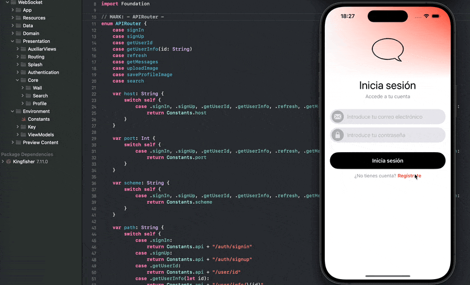

<h1 align="center">
  <strong>💬 WebSocket App 💬</strong>
</h1>

---

  <strong>Proyecto personal</strong>

---

  <strong>Autor:</strong> Salva Moreno Sánchez

  

## Índice
 
* [Herramientas](#herramientas)
* [Proyecto: 💬 WebSocket App 💬](#proyecto)
	* [Descripción](#descripcion)
	* [Instalación](#instalacion)
	* [Licencia](#licencia)

## Herramientas

  
 
  
 
  

* **iOS:** 16
* **Swift:** 5.9
* **Xcode:** 14.3.1

## Proyecto: 💬 WebSocket App 💬

### Descripción

Esta app de comunicación instantánea, similar a Twitter, permite a los usuarios registrarse, iniciar sesión, publicar mensajes y compartir imágenes en un muro público. La comunicación en tiempo real se realiza mediante WebSockets configurados en el cliente y conectados a una API desarrollada con Vapor. Las funcionalidades principales incluyen:

* **Registro e inicio de sesión de usuarios:** los datos de los usuarios (nombre, email, contraseña encriptada) se almacenan en una base de datos PostgreSQL.
* **Publicación de mensajes e imágenes:** los usuarios pueden escribir mensajes y subir imágenes, los cuales se muestran en el muro público en tiempo real gracias a la conexión por WebSockets.
* **Búsqueda de mensajes:** una pantalla dedicada permite realizar búsquedas de mensajes enviados por los usuarios, extrayendo la información de la API y de la base de datos PostgreSQL.
* **Cambio de imagen de perfil del usuario:** actualización de la imagen de perfil gestionada con la API y almacenamiento o borrado en BBDD.

La infraestructura del backend está gestionada mediante Vapor, asegurando una comunicación eficiente y segura entre el cliente y el servidor, mientras que PostgreSQL se encarga del almacenamiento persistente de los datos.

### Instalación

1. Clona el repositorio.
2. Abre el proyecto en XCode.
3. Introduce la api *key* en `Environment` > `Constants`. Para esta aplicación se emplea el servidor montado en Vapor que podemos encontrar [aquí](https://github.com/salvaMsanchez/Vapor-WebSocketAPI), cuya configuración y funcionalidad están explicadas detalladamente.
3. Conecta un dispositivo iOS o utiliza el simulador.
4. Ejecuta la aplicación.

### Licencia

Este proyecto está bajo la Licencia MIT - ver el archivo [LICENSE.md](https://github.com/salvaMsanchez/iOS-WebSocketsApp/blob/main/LICENSE.md) para más detalles.

---

[Subir ⬆️](#top)

---

